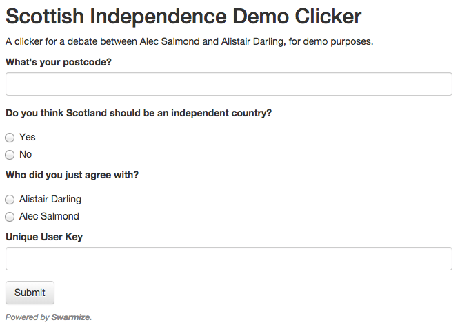
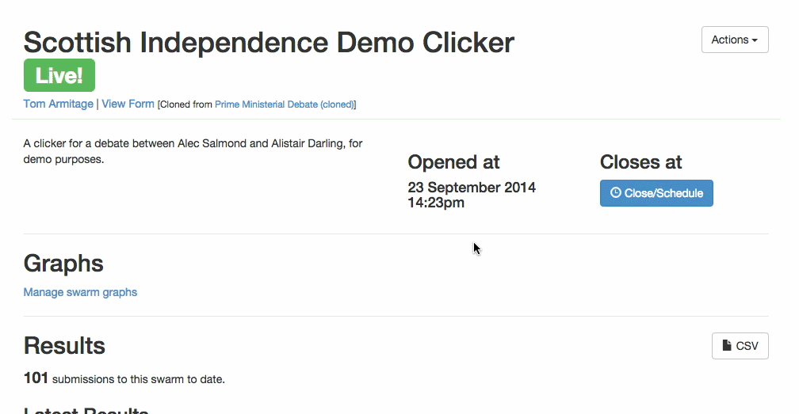
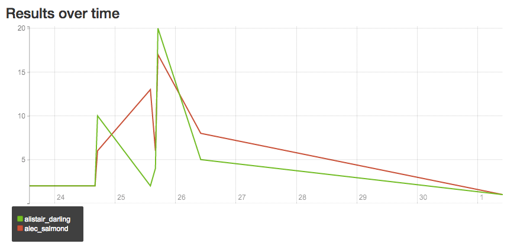
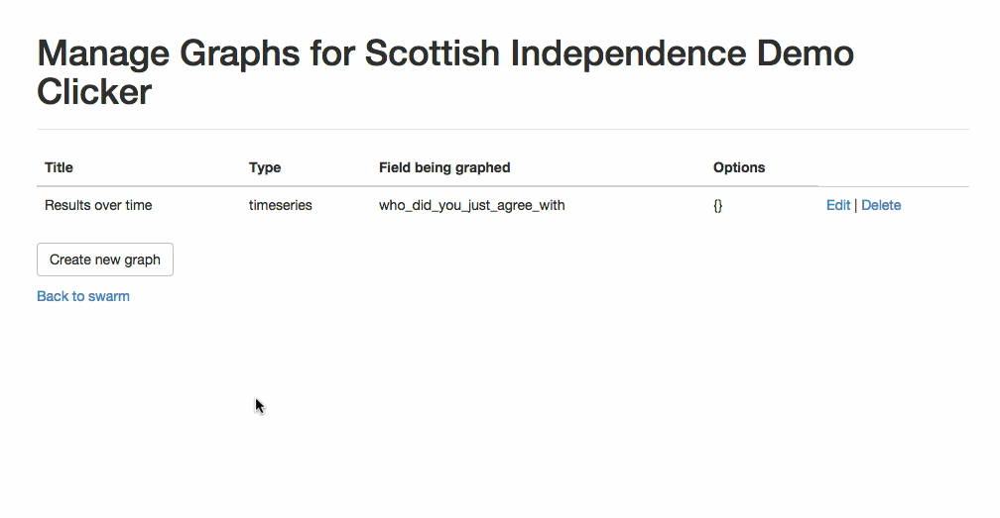
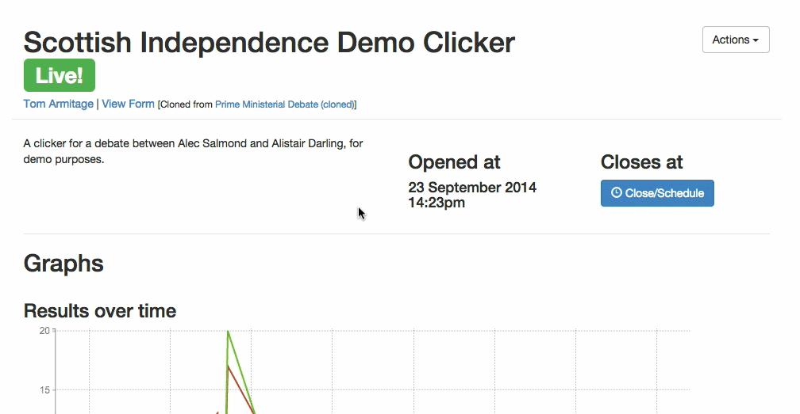
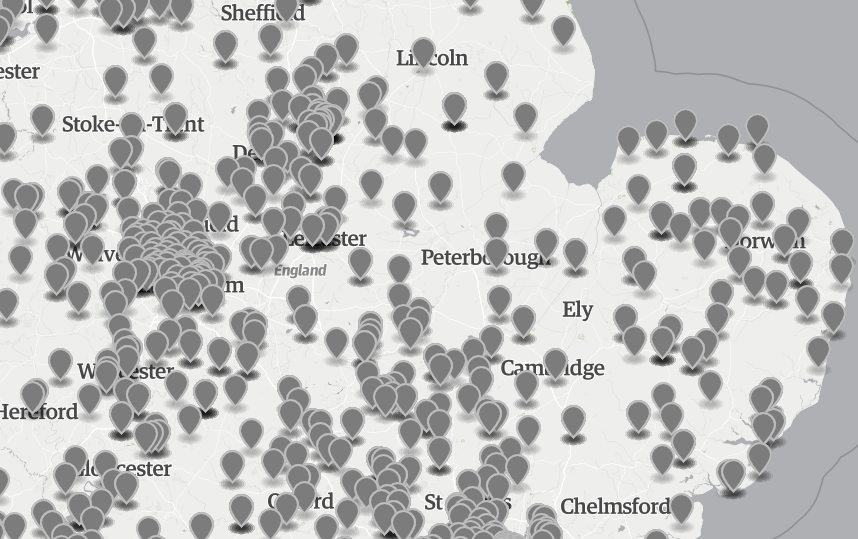

# Realtime data, and going beyond embeds: using Swarmize's Collector and Retrieval APIs to build a live 'clicker' for a TV debate

Swarmize can do more than just build forms for you to embed. You can actually insert data into Swarmize in almost any way you'd want. And Swarmize is designed to handle *really* high volumes of data. So let's use both those facts to build something a little more advanced: a 'clicker' for a TV debate, that'll allow audience members to give feedback in realtime.

## Goals

The realtime clicker is based on an outline from Seán Clarke. Sean's goals for realtime feedback on a TV debate were:

* compare how people intend to vote with what they responded to during the debate
* gauge the voting intent of people in locations
* and, of course, to do it for potentially millions of viewers clicking many times over the course of an hour.

All the above make this a great fit for Swarmize: we can use the capacity of the back-end, combined with the structured data, to easily get geolocated data into the system - and using graphs, we can provide a head-up display for any editors live-blogging the event.

This example uses the televised debate between Alastair Darling and Alex Salmond. We're going to make a small mobile-friendly webpage that asks people where they live, how they plan to vote, and then users click on each participant every time they agree with something they say.

[image: photo of clicker]

## Setup

Although we're not going to use Swarmize's auto-generated form, we still create the swarm like any other. When doing this, it's best to imagine how to turn the data you want to store into a series of questions to be answered. In our case, there are three key questions:

* What's your postcode? [*postcode*]
* Do you think Scotland should be an independent country? [*yes/no*]
* Who did you just agree with? [*pick one*]

Unlike the Broadband Survey, you can see that we expect each user to provide *many* responses - one response for each time they agree with somebody on screen. Obviously, we're going to want to distinguish these users at some point, so let's add an extra field that *isn't* a question:

* Unique User ID [*text*]

Once that's done, we can preview it in the traditional embedded form, and confirm it's all validating correctly.

## Working with the Collector API

Once we've set that up - and given the Swarm an open and close time, of course - we're ready to integrate with the Collector API. This is the API that inserts data into a swarm.

It's actually very basic: the URL `http://collector.swarmize.com/swarms/[swarmtoken]` will accept either form-encoded or JSON data POSTed to it. If that data is valid, it'll return a 200 status; otherwise, it'll return details of the invalid data. We can post direct to the Collector API because we've allow Cross-Origin Requests from anywhere on it.

We can get the correct names for all our fields from the Swarm's *code* page. Selecting 'get code' from the Swarm's action menu doesn't just give us embed code; it also provides the programmatic names of all the form fields, along with the correct values for the possible values of fields that only accepted a limited enumeration of data - `yesno`, `pickone`, `pickseveral`, and so forth. This page is all we need to populate our form with the correct fieldnames. (It's also a page that only people with permissions on the swarm can see. So if you want somebody else to send you the code page for a swarm, they'll need to make you a collaborator on the Swarm.)

Given that, we'll design our mobile UI as a simple HTML form, and then use Javascript to enhance it and make it feel a bit slicker. First, a user will enter their postcode and specify how they plan to vote. That data will be set in our HTML `<form>`; then, every time on what looks (to them) like a 'second' screen, they'll be submitting the form along with who they just agreed with.

We'll make the "Unique User ID" a hidden field. Then, we'll set a cookie with a timestamp in milliseconds, and use that to fill out the Unique User ID field. This means that if the user reloads the page, they'll still be counted as having the same User ID.

You can see this small HTML site in the [`livedebate-scotland`](https://github.com/guardian/swarmize/tree/master/examples/livedebate-scotland) example: `debate.js` holds all the Javascript to manage interactions and submit data; it's otherwise a simple, flat HTML site.

That's it: we've now made a custom front-end that submits data to Swarmize. We could, equally, have made a front-end as a native mobile app; all that matters is that we can submit HTTP POSTs to the endpoint.

## Graphs: Aggregation

Now that we've got data coming in, let's set up some graphs.

An obvious graph is going to be a timeseries data graph, tracking how popular each premier is over time. That's simple to set up: create a 'timeseries' graph for the field 'who did you just agree with'. This will show absolute support over time.

But it'd also be good to graph the data of how people plan to vote. If we just make a pie chart of the '*do you think Scotland should be an independent country*' field, every single row in the table would count once. We don't want that - because each individual person responding to the swarm may have responded many times.

This is where aggregation comes in: we can aggregate our results by another field. In this case, if we add '*Unique User Key*' as a field to aggregate by, each user will only be counted once, and we'll get a pie chart of intent per user, rather than per line.

These graphs will be useful overviews when we watch data come in during the debate itself.

## Getting Data Out: The Retrieval API

Finally, we may also which to extract data from Swarmize programatically. For this, there is a *Retrieval API* that allows the resultset to be queried externally.

The Retrieval API is located at `http://api.swarmize.com`, and [full documentation is on Github.](https://github.com/guardian/swarmize/blob/master/api/API_DOC.md)

API access is made as HTTP GETs to the appropriate endpoint, and data is returned as JSON (or, occasionally, GeoJSON).

API access is controlled via API keys, which are issued on a per-swarm basis. To an API key that has access to your swarm, go to the "*API Keys*" page from the swarm's action menu. From there, you'll be able to create and revoke tokens. (Revoking a token is useful for removing access to the swarm if you fear its data is being retrieved from outside sources).

It's worth stressing this point from the API Docs:

> The Retrieval API endpoint is open to Cross-Origin Requests. As such, you can make requests directly to the Retrieval API from in-page Javascript on your site.
> 
> HOWEVER: note that by doing so, you effectively allow anyone else to do so as well. You'll expose your API key to the world, and given that the names of fields/questions in Swarmize are effectively public knowledge, you should assume that anyone can thus enumerate over the swarm.
> 
> This might not be an issue: many swarms are statistical and entirely anonymous. But if you've got qualitative text fields that might contain personal data, you almost certainly shouldn't make in-page Javascript calls to the Retrieval API. Instead, it is recommended you behave as if CORS was disabled: make requests from your front-end to a back-end that you've written yourself, and make calls to the Retrieval API from your server-side code. This way, your key will be hidden from public view.

That said: it's another relatively straightforward exercise to build a single-serving site that will show us votes on a map - perhaps even clustered - simply by passing GeoJSON from the Swarmize API straight to a mapping library of our choice. You might want to consider back-end code to cluster results, as throwing thousands (or more) of points at a browser can be very slow indeed - but for quick prototyping, you can get something up very quickly:

[More example code can be found in the examples directory.](https://github.com/guardian/swarmize/tree/master/examples)