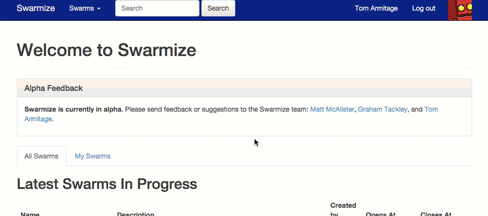
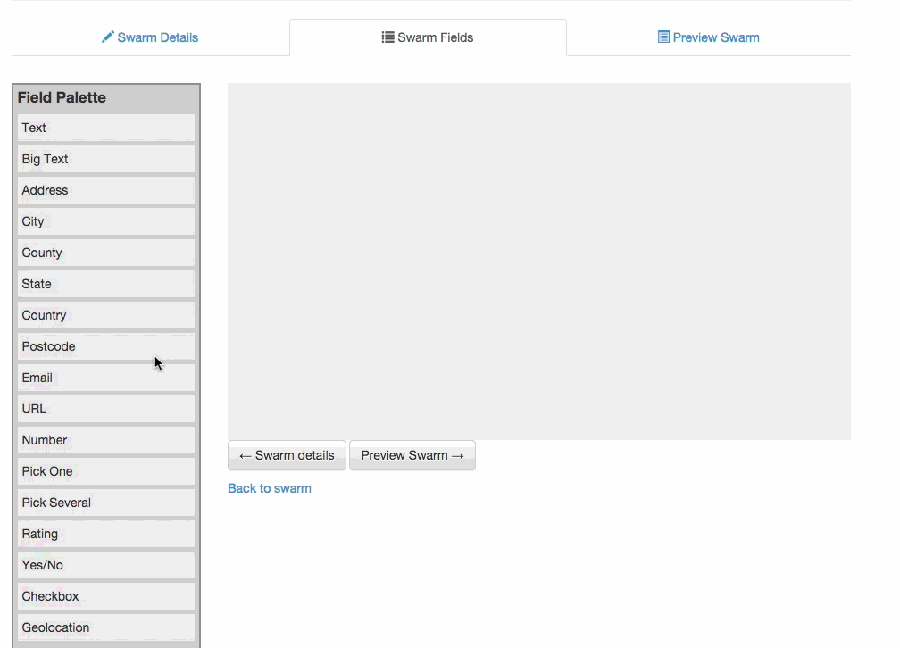
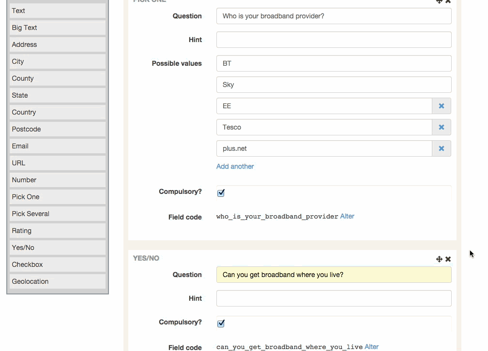
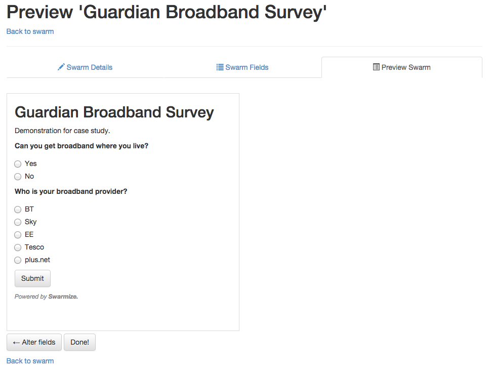
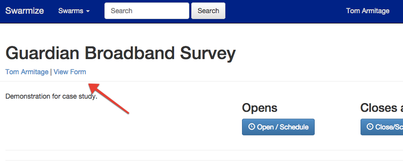
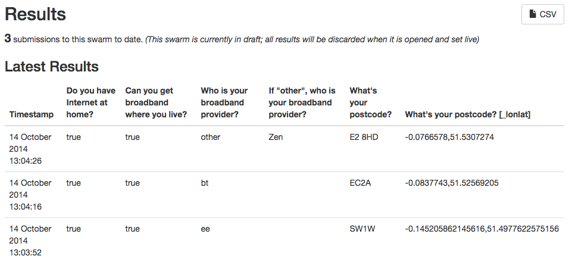
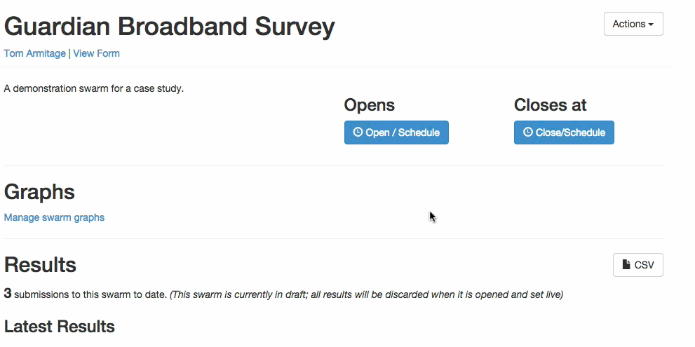
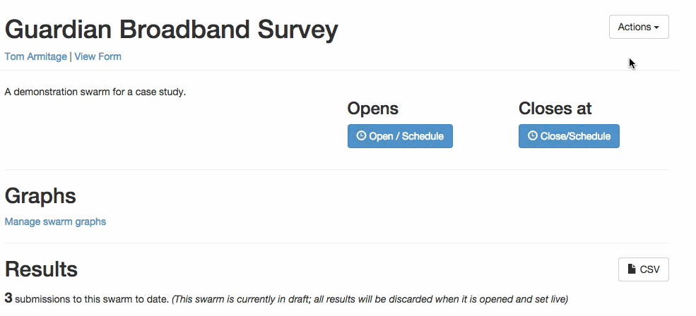
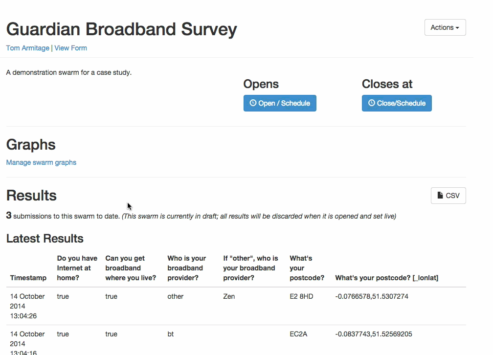
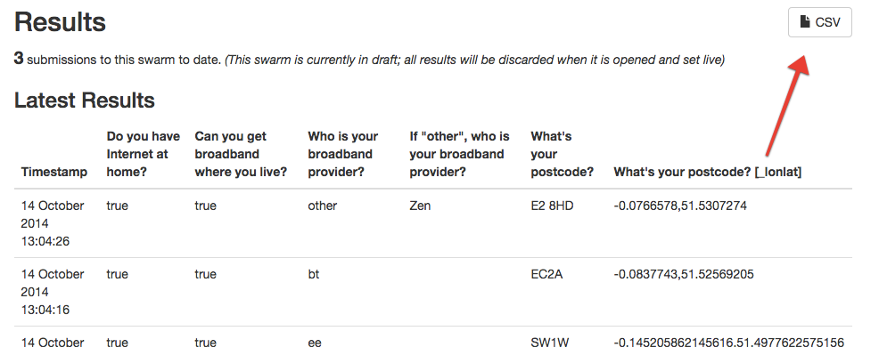

# Making a simple survey: the Guardian Broadband survey

As an example of how to make a simple survey in Swarmize - and to show some of its core functionality  - we'll replicate in part a survey that ran on the Guardian Datablog.

This survey ran in 2012. It asked people to compare the broadband speed they were advertised and what they actually get - along with where they were, and some survey questions about their opinions on government broadband investment.

It's a good example of the kind of simple survey that often gets embedded into *Guardian* articles, as a way of generating reader feedback and collecting a useful data-set.

We'll use it as a model for a **Swarm:** an online survey that runs for a period of time.

## Creating the Swarm

First, we'll need to create a swarm. We can log in to [http://alpha.swarmize.com] using our Guardian Google Apps account.

Then, we can create a swarm from the top-left 'swarms' menu:

The first thing we'll enter is the title and description of the Swarm. The title will, ultimately, appear in the embeddable Swarm form at the end. Their other purpose, though, is to make it clear what the Swarm is to other swarmize.com users - who may be interested in cloning your Swarm for their own use, or using your results.

When the title and description are done, we click '*add fields*'.

## Adding fields to the swarm

We can add fields to the swarm through drag and drop: we choose the archetype of the field from the palette on the left, and drag it into place.

When picking a field type, think about the *type of question* you are asking - not the type of field you want. "Text" and "bigtext" are useful fallbacks, but using a more specific type allows us to do *validation* and *post-processing*. By making a 'number' field, the user won't be allowed to enter non-numeric values. By making a 'postcode' field, the user won't be allowed to enter invalid UK postcodes (though full and half codes are both acceptable, eg, SW1A *or* SW1A 1AA).

There are a few options to fill out for each field, all optional:

* the *hint* will appear beneath the field, to explain it a bit more
* the *sample value* will appear within the field to illustrate what someone could type
* the *compulsory* checkbox will make this field compulsory: the form will be invalid and refuse to submit until it is checked
* some fields have *minimum* and *maximum* options. For a rating field, these indicate the upper and lower bound for the radio buttons that will be generated (for instance, 1-5). For a *pick several* field, this indicates the upper and lower bound for the number of choices that could be made - for instance, '*pick at least two*' or '*pick no more than three*'

Let's make a field to ask who your Broadband Provider is:

We can add subsequent fields above or below this. If we need to re-order fields, the four-arrow handle at the right of the field will do that; if we want to delete a field, the x mark will do that:

When we're happy with our fields - or just want to see how they look like so far - we can click *Preview Swarm* at the bottom of the page.

That'll save the swarm and show us what it looks like when it's embedded in a page.
when we're good, going to preview the swarm will save it and show us what it'll look like embedded in a page.

## Previewing the swarm

If you're happy with it, click save; otherwise, you can go back and alter fields/text. 

If you want to test your form's validation, feel free to enter data into it: you'll see the validation in action, and you'll also be able to submit sample data to your form (providing it's valid). Don't worry about this: all sample data will be removed from the swarm once you set it live in the world.

If you're happy with the swarm and don't need to do any more work, click 'done' to be returned to the Swarm's page.

## Testing the swarm

The swarm now exists within Swarmize - but it isn't live: ie, it can't be viewed in public or embedded yet.

For now, that means we can add sample data through the form. You can always ge to the auto-generated form for a swarm from the link under the header:

This form is the same code that can be embedded in a webpage. Any data you've added will appear in the table at the bottom of the page, which always shows the 10 latest entries:

As you can see, any fields that also generate values through post-processing - in this case, latlong generated for postcodes - will also appear in the table.

The table will *update in real time*. Here you can see the three latest responses - and a note reminding you that because this swarm is still in draft, they'll all be discarded when it opens.

## Open and Close times

To set a swarm live - so that it can be published - it needs to be *opened.* A swarm will then accept data until it *closes.* You can set that close time at any point during the swarm's life.

Once a swarm is open, you can no longer edit it in quite the same way. You can re-order questions, and make copy changes - but you can't add or remove fields. (If you've made a mistake and need to add or remove a field, don't worry: the section below on **Cloning Swarms** will explain what to do.)
 
Once a swarm is open, it'll also abandon all the test data you've inserted into it, and it'll accept data from the public. (The form linked at the top of the page will still work). It'll accept data until the date/time it's due to close (if set).

**All datetimes are London times.**

As the swarm accepts data, the table at the bottom (along with any other graphs) will update in real time.

## Sharing swarms with other people

It's likely you'll need to share access to your swarm with other users - you might need someone else to see it whilst it's in progress, or to let them edit it.

We can do so from the Swarm's *actions* menu: select Permissions, add a user with a Guardian email address (to invite them) and they'll be sent an email. It doesn't matter if they've not used Swarmize before: they'll be able to log in from the link they receive. From that point, they'll be able to share the swarm with you.

## Getting the embed code

Our swarm is open, our team have access to it; now, it's ready to be published.

To do that, we'll need an embed code. We can get that from the Swarm's *actions* menu, choosing 'code' and copying the embed code. By default, the embed code disables IFrame borders, and estimates the appropriate height of the IFrame. *You should check that the IFrame renders correctly in your CMS* - the height may need adjusting.

## Creating graphs

The swarm's created, we've embedded the code, and results are coming in - we can see the table updating in realtime. The next thing to do is to build some graphs.

Graphs in Swarmize aren't intended as final visualisations: rather, they're useful overviews of results, ways of 'taking the temperature' of a survey and working out what to focus on.

Swarmize can only graph particular fields - specifically, fields that have some countable element to them: pick one, pick several, yes/no.

There are two Graph types in Swarmize right now: pie graphs, and time-series graphs. The former are a great way of working out the overall popularity of a particular result; the latter a way of seeing how data changes and evolves over time. (See the *Independence Referendum* case study for a great example of time-series graphs in action).

Let's make a pie chart of Broadband providers.

In the Swarm, we click *Manage Swarm Graphs* and then *Create New Graph*. We'll call the graph *Broadband Providers %*, leave it set to being a Pie chart, and then choose the field *who is your Broadband Provider* to graph. 

(We'll leave *field to aggregate by* blank. This option lets us aggregate results sharing the same result for a particular column - which is useful if you have a swarm that one user might answer many times, and want to only count them once in your graph - the *Independence Referendum* case study use this).

That's it! We can return to the swarm and see the graph in action. It'll update as we receive results.

## Downloading data

We've got a heads-up of what's happening in Swarmzie - rough charts of the overall results, and a window onto the latest data. But at the end of a swarm, we'll want to be able to download all the data from the swarm, to analyse and use in greater detail.

That can be done from the 'CSV' link at the top right of the results table. Clicking this will get you a dump of all the data to date in CSV format, ready to be loaded into a spreadsheet of your choice.

## Cloning

Now the swarm's complete: what if you want to run it again?

Swarm's can't be re-opened. But they can be *cloned*. Cloning a swarm will make a copy of it, with you as the primary creator, all the same questions as before, a new unique identifier ('token'), and an empty results set. A cloned swarm has no open or close time - so you're free to edit and amend all the fields.

As such, there are lots of reasons to clone a swarm:

* using a previous set of questions as a starting point for a new swarm - for instance, if you want to repeat a survey a year later, or run longitudinal surveys
* borrowing somebody else's swarm as a template for one you'd like to run
* fixing an issue with a swarm you opened too soon

Cloning is straightforward: from any swarm's *action* menu (even if it's not one you own, just choose 'clone'):

